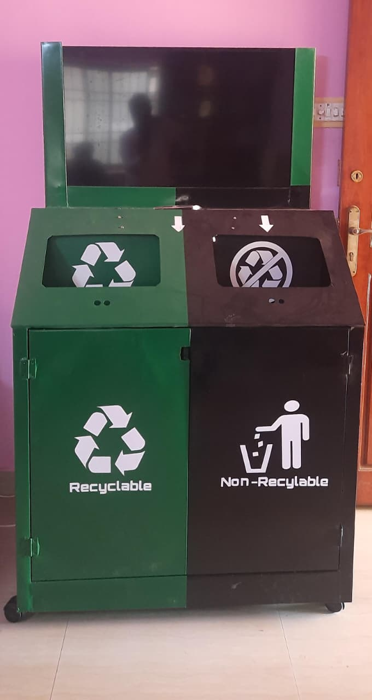

# ♻️ ECO Waste Sorter 

An intelligent **waste sorting and monitoring system** powered by **YOLOv8**, **Google Gemini AI**, and **Firebase Realtime Database**.  
This project runs on a **Raspberry Pi**, integrating **AI-based object classification** with **ultrasonic bin-level monitoring**.

---

## 🚀 Features

- 🧠 **AI Waste Classification**
  - YOLOv8 + Gemini API integration for object recognition
  - Classifies items as *Recyclable* or *Non-Recyclable*
- 📷 **Real-time Camera Feed**
  - Detects person and object proximity
- 🔊 **Ultrasonic Bin Monitoring**
  - Measures bin fill levels in real time using `bin_level.py`
- ☁️ **Firebase Integration**
  - Updates and fetches bin fill data from the Firebase Realtime Database
- 🌱 **Sustainability Tracking**
  - Calculates CO₂ savings and recycling rates
- 💻 **User Interface**
  - Modern PyQt5 GUI with videos, animations, and data visualization

---

## 🧰 Folder Structure

```
AI-Waste-Sorter/
│
├── bin_level.py              # Ultrasonic bin level sensor handler
├── testqr.py                 # Main PyQt5 app (YOLO + Gemini + Firebase)
│
├── requirements.txt
├── .env.example
├── README.md
├── .gitignore
│
├── images/
│   ├── Intro_video.mp4
│   ├── Video.mp4
│   ├── logo.png
│   ├── left_image.png
│   ├── right_image.png
│   ├── green_bin_person.png
│   └── black_bin_person.png
│
└── models/
    ├── yolov8n.pt            # YOLOv8 detection model
    └── best.pt               # YOLOv8 waste classification model
```

---

## ⚙️ Installation Guide

### 1️⃣ Clone the Repository
```bash
git clone https://github.com/<your-username>/AI-Waste-Sorter.git
cd AI-Waste-Sorter
```

### 2️⃣ Install Dependencies
```bash
pip install -r Requirement.txt
```

### 3️⃣ Configure Environment Variables
Copy the `.env.example` file and rename it:
```bash
cp .env.example .env
```

Add your **Gemini API Key** in `.env`:
```
GOOGLE_API_KEY=your_gemini_api_key_here
```

### 4️⃣ Add YOLO Models
Download or copy your trained models:
- `yolov8n.pt` (for object/person detection)
- `best.pt` (for waste item classification)

Place them inside the `models/` folder.

### 5️⃣ Run the Application
```bash
python3 testqr.py
```

---

## 🧩 Firebase Setup

Create a **Firebase Realtime Database** and structure it like this:

```
bins/
 ├── 1/
 │    └── percentage   ← Non-Recyclable Bin
 └── 2/
      └── percentage   ← Recyclable Bin
```

Update your Firebase URL in:
- `testqr.py`
- `bin_level.py`

```python
FIREBASE_BASE_URL = "https://your-project-id-default-rtdb.asia-southeast1.firebasedatabase.app"
```

---

## 🧠 Hardware Requirements

| Component | Description |
|------------|--------------|
| Raspberry Pi 5 | Main controller |
| HC-SR04 Ultrasonic Sensors | Bin level detection |
| servo motor | Bin cover or actuator (optional) |
| USB / Pi Camera | Real-time waste detection |
| 5V Power Supply | System power |
| Internet / Wi-Fi | Firebase & Gemini connectivity |

---

## 📊 Data Flow Overview

1. **Camera Feed → YOLOv8**  
   Detects person and object.
2. **YOLOv8 / Gemini**  
   Classifies waste type.
3. **Firebase Update**  
   Sends bin fill percentage and classification.
4. **Ultrasonic Sensors → bin_level.py**  
   Continuously measure bin height.
5. **PyQt5 Dashboard**  
   Displays live camera feed, sustainability report, and bin levels.

---

## circuit diagram


---
## 🌱 Sustainability Metrics

Each item classified as recyclable increases:
- **CO₂ Saved (kg)**
- **Equivalent Trees Planted**

Tracked in the app’s right panel in real-time.

---

## 🧾 License

This project is released under the **MIT License**.  
Feel free to modify and use it for research or educational purposes.

---

## 👨‍💻 Author

Developed by **Giriprasath T K**  
📧 Contact:tkcharan8@gmail.com 
📍 India

---

## 💡 Future Improvements
- Integrate servo-based bin lid control.
- Add cloud analytics dashboard for waste statistics.
- Expand YOLO dataset for local waste categories.
- Add offline mode with local SQLite data sync.

---

### 🖼 Preview 

---

